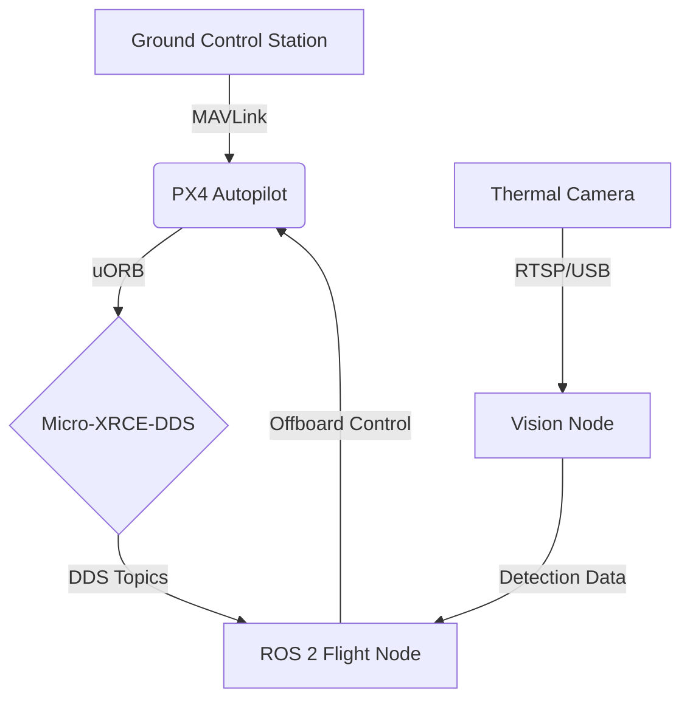

# 🚁 Autonomous Thermal-Imaging Hexacopter for Precision Agriculture

**Location:** Bihar, India | **Status:** Research & Development (PhD Track) | **Stack:** ROS 2 Jazzy + PX4 v1.15

## 👶 For Young Engineers (The "5-Year-Old" Explanation)
**What is this?**
Imagine a flying robot (a drone) that helps farmers. It has special "heat vision" eyes (thermal camera).

**What does it do?**
1.  **Flies by itself:** It doesn't need a pilot. It follows a map like a treasure hunter.
2.  **Finds sick plants:** It looks at the field. If a plant is too hot or looks like a weed, the drone sees it.
3.  **Sprays medicine:** When it finds a weed, it sprays a little bit of water/medicine right on top of it.

**Why?**
To save farmers time and stop them from using too much chemical spray on healthy plants!

## 📚 Documentation & Guides
*   **[📖 Project Literature (The Full Story)](PROJECT_LITERATURE.md):** A complete guide explaining the project from "Flying Toy" to "Product", perfect for presentations.
*   **[🚀 Launch Guide](LAUNCH_GUIDE.md):** Step-by-step instructions to start the simulation and autonomous missions.
*   **[🧠 Learning Journey](LEARNING_JOURNEY.md):** A diary of mistakes, fixes, and lessons learned during development.
*   **[🎮 Manual Flight Guide](MANUAL_FLIGHT_GUIDE.md):** How to fly the drone manually using QGroundControl.

## 1. Project Overview
This repository contains the source code for an autonomous heavy-lift hexacopter designed for precision agriculture applications in the Bihar region. The system integrates thermal imaging for crop health monitoring and automated spraying mechanisms. The architecture is built on ROS 2 (Robot Operating System) and PX4 Autopilot, ensuring industry-standard reliability and scalability.

**Key Objectives:**
*   **Autonomous Navigation:** GPS-denied and RTK-GPS based path planning.
*   **Computer Vision:** Real-time thermal analysis using YOLOv8/TFLite.
*   **Precision Actuation:** Targeted spraying based on vegetation index (NDVI) data.

## 2. Technical Stack

| Component | Specification |
| :--- | :--- |
| **Middleware** | ROS 2 Jazzy Jalisco |
| **Flight Controller** | PX4 Autopilot v1.14+ (SITL & Hardware) |
| **Communication** | Micro-XRCE-DDS Agent (uORB to DDS Bridge) |
| **Simulation** | Gazebo Harmonic / Classic |
| **AI/ML** | TensorFlow Lite, YOLOv8, OpenCV |
| **Language** | Python 3.10+, C++17 |

## 3. System Architecture



## 4. Directory Structure
*   `nodes/`: Python executable scripts for control and vision.
*   `launch/`: System-wide launch files (ROS 2 + PX4 + Gazebo).
*   `models/`: SDF/URDF descriptions of the hexacopter and sensors.
*   `ai_models/`: Pre-trained TFLite/ONNX weights for crop detection.
*   `worlds/`: Gazebo simulation environments (Bihar field mappings).
*   `msg/`: Custom ROS 2 message definitions.

## 5. PhD Milestone Checklist

- [x] **Phase 1: Simulation Environment**
    - [x] Hexacopter dynamic model validation in Gazebo.
    - [x] PX4 SITL integration with ROS 2 Offboard control.

- [ ] **Phase 2: Perception System**
    - [ ] Thermal camera driver integration.
    - [ ] Real-time weed detection algorithm (YOLOv8) optimization.

- [ ] **Phase 3: Field Trials (Bihar)**
    - [ ] Hardware-in-the-Loop (HITL) verification.
    - [ ] Autonomous spraying pattern execution.
    - [ ] Data collection and thesis defense.

## 6. Build & Run

```bash
cd ~/uav_agricultural_drone_project
colcon build --symlink-install
source install/setup.bash

# Launch full system
./launch_split.sh
```

---
*Maintained by Abhishek for PhD Research.*